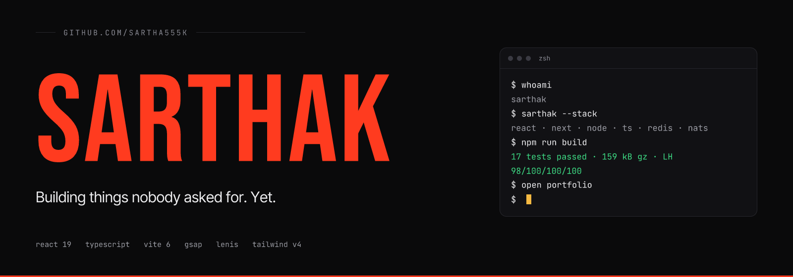
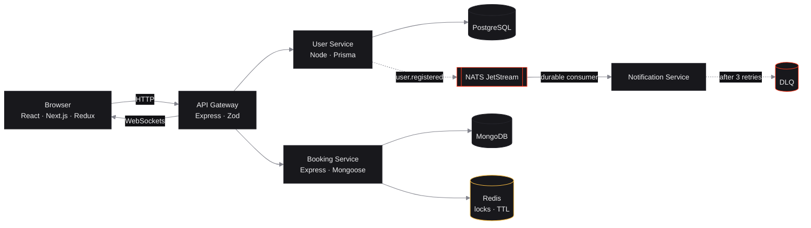

<a href="https://github.com/sartha555k">
  
</a>

<p align="center">
  
</p>

<p align="center">
  <a href="https://www.linkedin.com/in/sarthak-patel-14938322a/"></a>
  <a href="mailto:sarthak.code30@gmail.com"></a>
  <a href="https://resume-x-8s55.vercel.app"></a>
  
</p>

<br />

```console
$ cat now.txt
building   : eventbus-services v2 (outbox pattern, k8s manifests)
learning   : PostgreSQL internals, Go
open to    : full-time roles · contract work · pairing on hard problems
location   : Indore, IN · IST (UTC+5:30) · remote-friendly
```

## What I build

Web apps, end to end, mostly in TypeScript. The interesting part is never the syntax. It's the seat two people click at the same millisecond, the message the queue delivers twice, the shortcut you regret in three months.

<table>
  <tr>
    <td width="50%" valign="top">
      <h3><a href="https://github.com/sartha555k/eventbus-services">eventbus-services</a></h3>
      <p>Two services that never call each other. Messages that never get processed twice.</p>
      <p>NATS JetStream with durable consumers, idempotency keys checked before any side effect, retries with back-off, a dead-letter queue, correlation IDs across HTTP and NATS headers. One <code>docker compose up</code>.</p>
      <p><code>TypeScript</code> <code>Express</code> <code>NATS</code> <code>Prisma</code> <code>PostgreSQL</code> <code>Zod</code> <code>Docker</code></p>
    </td>
    <td width="50%" valign="top">
      <h3><a href="https://github.com/sartha555k/moviebook">MovieBook</a></h3>
      <p>Two people cannot buy the same seat, even if they click at the same millisecond.</p>
      <p><code>SET lock:show:seat session NX PX 12000</code>. Atomic, self-expiring seat holds in Redis; the countdown the user sees is the TTL Redis holds. Payment converts a lock to a booking in one step.</p>
      <p><code>React</code> <code>Redux Toolkit</code> <code>Express</code> <code>MongoDB</code> <code>Redis</code> <code>JWT</code> · <a href="https://movie-booking-creative-upaay.vercel.app">live</a></p>
    </td>
  </tr>
  <tr>
    <td width="50%" valign="top">
      <h3><a href="https://github.com/sartha555k/Crack.AI">Crack.AI</a></h3>
      <p>An interviewer that asks, listens, and scores.</p>
      <p>Role-adaptive questions across 18+ roles from a FastAPI service around an LLM, Whisper for spoken answers, Socket.IO for session state, per-question feedback. Yes, I practised on it. It gave me 6.2/10.</p>
      <p><code>React</code> <code>Node</code> <code>MongoDB</code> <code>FastAPI</code> <code>Whisper</code> <code>Ollama</code> <code>Socket.IO</code></p>
    </td>
    <td width="50%" valign="top">
      <h3><a href="https://github.com/sartha555k/ResumeX">ResumeX</a></h3>
      <p>Fill a form, watch the résumé render live, let a model write the boring parts.</p>
      <p>Live preview synced through Redux Toolkit, templates sharing one data model, export and share links. OpenAI drafts summaries from the user's own inputs only. Memoised per section so a keystroke re-renders one block.</p>
      <p><code>React 19</code> <code>Vite</code> <code>Redux Toolkit</code> <code>Express</code> <code>MongoDB</code> <code>OpenAI</code> · <a href="https://resume-x-8s55.vercel.app">live</a></p>
    </td>
  </tr>
</table>

<details>
  <summary><b>Two more</b></summary>
  <br />
  <ul>
    <li><b>program-intel</b> · CSV exports in, monthly review out. A program intelligence dashboard for an education nonprofit where every headline number traces back to the rows that produced it. <code>React</code> <code>Node</code> <code>MongoDB</code> · <a href="https://mantra-4-change.vercel.app">live</a></li>
    <li><b>ott-desktop</b> · A mobile micro-drama site rebuilt for a 27-inch screen. Dozens of hover-scaling 9:16 video cards at 60fps with <code>content-visibility</code> and previews that pause offscreen. <code>Next.js</code> <code>TypeScript</code> <code>Tailwind</code> · <a href="https://bullet-alpha.vercel.app">live</a></li>
  </ul>
</details>

## How a thing I ship usually looks



## Commit history

```
a1f3c9e (HEAD -> main) now                      # looking for the next hard problem
7d2e4b1 (side) eventbus-services                 # 2026-08 · first thing I'd call infrastructure
c58a0f2 (side) MovieBook                         # 2026-06 · the project I get asked about most
e93b7d4 (work) Full Stack Intern, DigiFlex.ai    # 2026-06 · shared component package, SSR on Next.js
b16f2a8 (work) Full Stack Intern, Alphawizz      # 2026-04 · real-time order tracking over WebSockets
f4c81e0 (side) ResumeX goes live                 # 2025-12 · first deployed product with real users
2ab9d73 (main) Graduated, B.Tech IT, JEC         # 2025-01 · and immediately started shipping
```

## Stack, honestly

<p>
  
  
  
  
  
  
  
  
  
  
  
  
  
  
</p>

Comfortable: everything above. Learning: PostgreSQL internals, Go. Will fight you about: none of it. I care less about which framework wins than whether the thing runs on a Tuesday when nobody's watching.

## Numbers that aren't on the résumé

<p align="center">
  <a href="https://github.com/sartha555k?tab=repositories">
    
  </a>
</p>

<p align="center">
  
  
  
</p>

<p align="center">
  
</p>

<p align="center">
  <picture>
    <source media="(prefers-color-scheme: dark)" srcset="https://raw.githubusercontent.com/sartha555k/sartha555k/output/pacman-contribution-graph-dark.svg" />
    
  </picture>
</p>

<p align="center">
  <sub>Every image in this section is rendered once a day by <a href="https://github.com/sartha555k/sartha555k/blob/main/.github/workflows/profile-assets.yml">a workflow in this repo</a>, not fetched from a third-party service. The status card is <a href="https://github.com/sartha555k/sartha555k/blob/main/status-card/render.mjs">120 lines of satori</a> against the GitHub GraphQL API.</sub>
</p>

<br />

<p align="center">
  <sub>
    <code>sarthak.code30@gmail.com</code> · Indore, IN · IST ·
    <a href="https://www.linkedin.com/in/sarthak-patel-14938322a/">linkedin</a> ·
    <a href="./llms.txt">llms.txt</a> for the agents reading this
  </sub>
  <br />
  <sub>Building things nobody asked for. <b>Yet.</b></sub>
</p>
